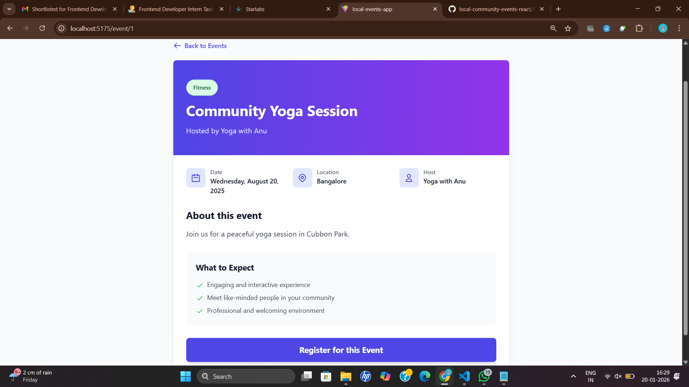
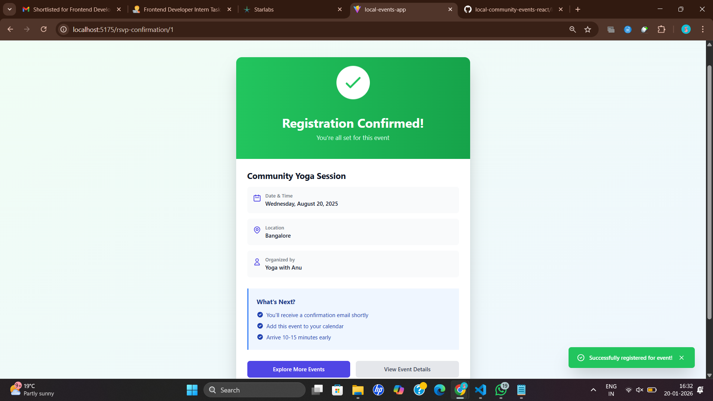
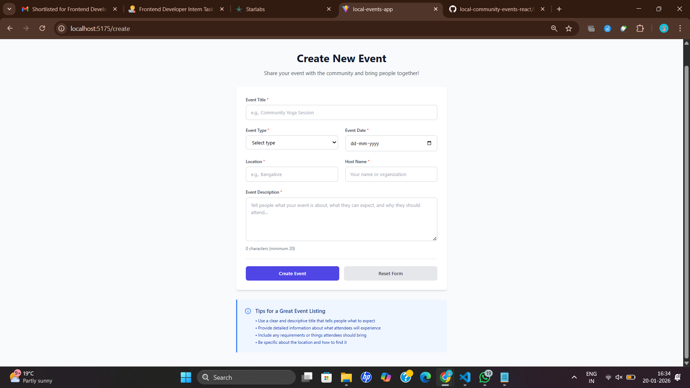

# 🎉 Local Community Events Platform

A modern React-based web application for discovering, exploring, and joining local community events. Built with React, React Router, Context API, and TailwindCSS.


## 📋 Table of Contents

- [Features](#features)
- [Tech Stack](#tech-stack)
- [Getting Started](#getting-started)
- [Project Structure](#project-structure)
- [Usage Guide](#usage-guide)
- [Screenshots](#screenshots)

## ✨ Features

### Core Features

- 🔍 **Browse Events**: View a curated list of local community events in a beautiful grid layout
- 🎯 **Advanced Filtering**: Filter events by type, location, and date
- 🔎 **Smart Search**: Search events by title, description, or host name
- 📄 **Pagination**: Navigate through events with easy pagination
- 📱 **Responsive Design**: Works seamlessly on mobile, tablet, and desktop
- 🎫 **Event Details**: View comprehensive event information including date, location, host, and description
- ✅ **RSVP System**: Register for events with a beautiful confirmation page
- ➕ **Create Events**: Host your own events with a fully validated form

### User Experience

- 🎨 Beautiful, modern UI with gradient accents
- 🌈 Color-coded event types for easy identification
- ⚡ Fast and smooth navigation with React Router
- 📊 Real-time event count and registration tracking
- 🎭 Interactive cards with hover effects

## 🛠 Tech Stack

- **Framework**: React 18
- **Build Tool**: Vite
- **Routing**: React Router v6
- **State Management**: Context API
- **Styling**: TailwindCSS
- **Package Manager**: npm

## 🚀 Getting Started

### Prerequisites

Make sure you have the following installed on your system:

- Node.js (v16 or higher)
- npm

### Installation

1. **Clone the repository**

   ```bash
   git clone https://github.com/yourusername/local-events-app.git
   cd local-events-app
   ```

2. **Install dependencies**

   ```bash
   npm install
   ```

3. **Start the development server**

   ```bash
   npm run dev
   ```

4. **Open your browser**

   Navigate to `http://localhost:5173` (or the port shown in your terminal)

### Build for Production

```bash
npm run build
```

This will create an optimized production build in the `dist` folder.

### Preview Production Build

```bash
npm run preview
```

## 📁 Project Structure

```
local-events-app/
├── public/                 # Static assets
├── src/
│   ├── components/         # Reusable components
│   │   ├── EventCard.jsx   # Event card component
│   │   ├── FilterBar.jsx   # Filter controls
│   │   ├── SearchBar.jsx   # Search input
│   │   └── Navbar.jsx      # Navigation bar
│   ├── context/            # Context API state management
│   │   └── EventContext.jsx
│   ├── data/               # Mock data
│   │   └── events.json     # Event data
│   ├── pages/              # Page components
│   │   ├── Home.jsx        # Home/Explore page
│   │   ├── EventDetail.jsx # Event detail page
│   │   ├── RSVPConfirmation.jsx # Confirmation page
│   │   └── CreateEvent.jsx # Create event form
│   ├── App.jsx             # Main app component
│   ├── main.jsx            # Entry point
│   └── index.css           # Global styles
├── tailwind.config.js      # Tailwind configuration
├── vite.config.js          # Vite configuration
└── package.json            # Dependencies
```

## 📖 Usage Guide

### Browsing Events

1. Visit the home page to see all available events
2. Use the search bar to find specific events by title, description, or host
3. Apply filters to narrow down events by:
   - Event Type (Fitness, Music, Workshop, etc.)
   - Location (Bangalore, Mumbai, Delhi, etc.)
   - Date (specific date selection)
4. Navigate through pages using pagination controls

### Viewing Event Details

1. Click on "View Details" button on any event card
2. See comprehensive information including:
   - Event title and description
   - Date, location, and host information
   - Event type and category
   - Registration status
3. Click "Register for this Event" to RSVP

### Registering for Events

1. From the event detail page, click "Register for this Event"
2. You'll be redirected to a confirmation page
3. The event will be marked as "Registered" in your view
4. Your registration count is tracked in the navbar

### Creating New Events

1. Click "Create Event" in the navigation bar
2. Fill out the event form:
   - Event Title (minimum 5 characters)
   - Event Type (select from dropdown)
   - Event Date (must be in the future)
   - Location (type or select from existing)
   - Host Name (minimum 3 characters)
   - Description (minimum 20 characters)
3. All fields are validated in real-time
4. Click "Create Event" to submit
5. Your new event will appear in the event list

## 📸 Screenshots

### Home Page – Explore Events


_Browse and filter through community events_

### Event Detail Page


_View comprehensive event information_

### RSVP Confirmation


_Registration confirmation with next steps_

### Create Event Form


_Easy-to-use event creation form_

### Home Page - Explore Events

The main landing page displays all community events in a beautiful grid layout with search and filter capabilities.

### Event Detail Page

Comprehensive view of event information with RSVP functionality.

### RSVP Confirmation

Beautiful confirmation page after successful registration.

### Create Event Form

User-friendly form to create and host new events with validation.

## 🎨 Features Breakdown

### Event Types

- 🏃 **Fitness**: Yoga, Meditation, Running
- 🎵 **Music**: Concerts, Jam Sessions
- 🤝 **Meetup**: Networking, Social Gatherings
- 📚 **Workshop**: Learning, Skill Development
- ⚽ **Sports**: Tournaments, Outdoor Activities
- 👥 **Social**: Community Service, Cleanup
- 🎭 **Entertainment**: Comedy, Film Screenings

### State Management

The app uses React Context API to manage:

- Event list and filtering
- Search functionality
- User registrations
- Filter state

### Responsive Design

- Mobile-first approach
- Breakpoints for tablet and desktop
- Touch-friendly controls
- Optimized grid layouts

## 🔧 Configuration

### Tailwind Configuration

The project uses a custom Tailwind configuration located in `tailwind.config.js`. You can customize:

- Color schemes
- Font families
- Spacing
- Breakpoints

## 🤝 Contributing

Contributions are welcome! Please feel free to submit a Pull Request.

## 📝 License

This project is open source and available under the MIT License.

---

### Quick Start Commands

```bash
# Install dependencies
npm install

# Run development server
npm run dev

# Build for production
npm run build

# Preview production build
npm run preview
```

Enjoy exploring and creating local community events! 🎉
